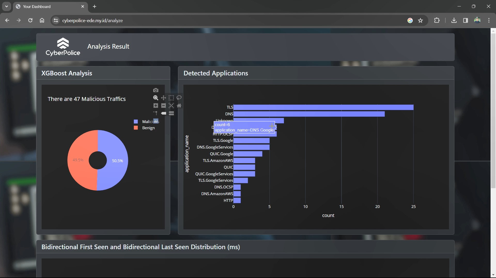

# PERISARI - Perlindungan dari Kekerasan Seksual di Telkom Universiti

## Team Member (Kelompok 01)
- Berlin (BRLN)
- Huelva (HLVA)
- Butterworth (BTWH)
- Phayao (PHAY)

## Project Description

PERISARI menyediakan solusi instan dan efektif untuk mencegah kekerasan seksual, membantu individu dalam membentuk kebiasaan positif dan memupuk pola pikir yang sehat. Aplikasi ini mencakup berbagai fitur yang disesuaikan untuk mendukung pengguna:

- **_Awareness Quiz_**: Bagian ini membantu pengguna memahami tingkat pengetahuan dan kesadaran mereka saat ini tentang pencegahan kekerasan seksual. Dengan menjawab pertanyaan terkait perilaku, batasan, dan persetujuan, pengguna memperoleh wawasan tentang area yang perlu mereka fokuskan untuk peningkatan.

- **_Empowerment Resources_**: Kesejahteraan mental dan emosional adalah komponen integral dalam mencegah kekerasan seksual. PERISARI menawarkan koleksi sumber daya yang disusun dengan baik, termasuk artikel, video, dan tips perawatan diri, memberdayakan pengguna dengan pengetahuan dan strategi untuk melindungi diri dan mendukung orang lain.

- **_Community Support_**: Membangun komunitas yang mendukung sangat penting dalam memerangi kekerasan seksual. PERISARI memfasilitasi hubungan dengan individu sejiwa, korban, dan advokat melalui forum, ruang obrolan, dan kelompok dukungan, memupuk solidaritas dan ketangguhan.

Dengan mengintegrasikan fitur-fitur ini, PERISARI memberi pengguna alat dan dukungan yang diperlukan untuk mencegah kekerasan seksual, mempromosikan keselamatan, dan membudayakan budaya penghargaan dan pemberdayaan.

## Data Source
1. [Satu data Indonesia](https://data.go.id/home)
2. [UNDP Quality Index - Data World](https://data.world/adamhelsinger/undp-gender-inequality-index)
3. [Nilai Tukar Nelayan Berdasarkan Provinsi di Indonesia - Open Data Jabar](https://opendata.jabarprov.go.id/id/dataset/nilai-tukar-nelayan-berdasarkan-provinsi-di-indonesia)

## Platform
  
  
  


## Project Images

**_Daat Dashboard_:**
](readme-assets/dashboard.png)

**_Deployment Web_:**


## Run the Project
```Powershell
# vanilla terminal
streamlit run app.py

# quit
ctrl-c
```

Sales Dashboard: https://www.salesdashboard.pythonandvba.com/
