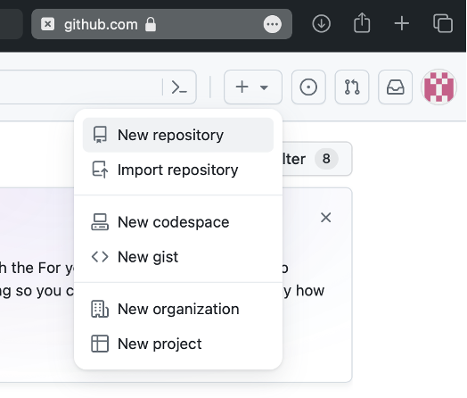
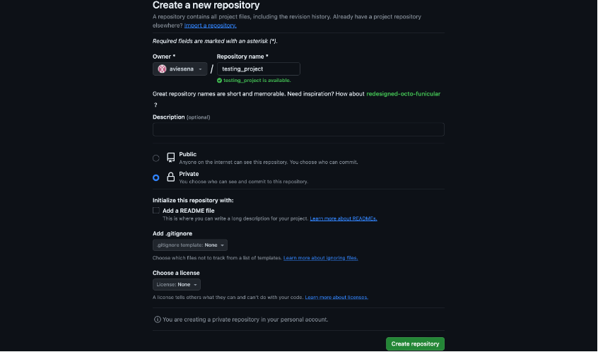
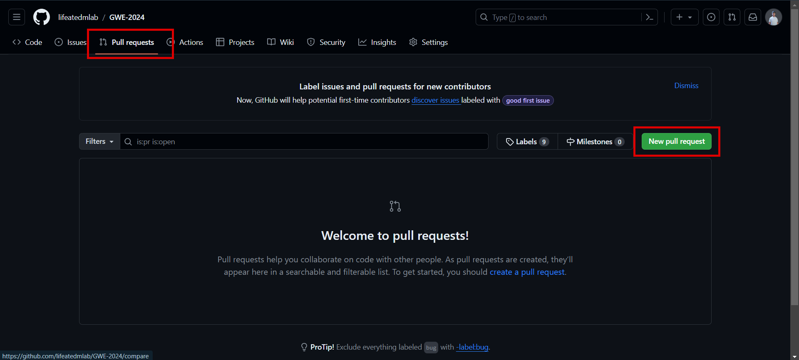

# **IT Collaboration (Git, & Github)**

Pada pertemuan GWE yang pertama ini, kita akan membahas mengenai tools-tools yang akan teman-teman pakai selama belajar di Study Group EDM. Mulai dari Notebook hingga Github, tools-tools ini dibutuhkan karena kalian akan berkolaborasi dalam sebuah kelompok untuk mengerjakan suatu projek.

<h2 style="border-bottom: 0.5px solid red; width: 80%; margin: 0 auto;">

## What is Git & Github and How to Use It?

Git dan GitHub, dua platform yang dibuat oleh perusahaan yang sama, memiliki tujuan yang serupa tetapi fitur yang berbeda. Keduanya memberikan dukungan yang besar bagi para pengembang perangkat lunak dalam mengelola kode sumber secara kolaboratif. Dengan menggunakan sistem kontrol versi, pekerjaan tim dapat dipantau dan dievaluasi dengan efisien.

### Clarification of misconceptions and explanation of both platforms

**Git** adalah perangkat lunak berbasis Version Control System (VCS) yang digunakan untuk merekam setiap perubahan dalam file atau repositori proyek. Pengembang sering menggunakan Git untuk distribusi revisi (VCS terdistribusi), memungkinkan penyimpanan database tidak hanya di satu lokasi tetapi diakses oleh semua anggota tim yang terlibat dalam pengembangan kode. Komponen penting dalam Git adalah "commit" yang digunakan untuk menyimpan catatan perubahan pada file. Dengan melakukan commit, pengembang dapat dengan mudah kembali ke versi sebelumnya menggunakan perintah "checkout". Penggunaan Git memerlukan instalasi perangkat lunak terlebih dahulu agar dapat digunakan secara offline. Perangkat lunak ini tersedia secara gratis melalui situs resmi unduhan Git.

**GitHub** adalah platform manajemen proyek, sistem versioning kode, dan komunitas sosial bagi para pengembang di seluruh dunia. Perlu diketahui, GitHub memiliki versi induknya yaitu Git yang merupakan software version controlled system yang dilakukan secara offline. GitHub menyediakan layanan cloud untuk menyimpan dan mengelola berbagai proyek atau repositori Git. Dengan sifatnya yang berbasis online, GitHub memungkinkan pengguna untuk berkolaborasi dalam pengeditan repositori atau proyek dari lokasi yang berbeda. Hal Ini memudahkan pengguna dan tim dalam mengorganisir folder yang berisi file terkait pemrograman yang sedang dikerjakan.

Meskipun beberapa **perbandingan antara Git dan GitHub** mungkin tidak selalu jelas, keduanya sebenarnya sangat berbeda. Untuk memahami perbedaan ini, mari lihat dari sisi dasarnya. Git adalah sistem yang digunakan untuk melacak perubahan pada kode agar hidup programmer lebih mudah. Di sisi lain, GitHub adalah sebuah layanan hosting. Apa yang di-host oleh layanan ini? Itu cukup sederhana - GitHub meng-host repositori Git. Dalam istilah yang lebih sederhana, Git adalah alat yang digunakan untuk mengelola kode, sementara GitHub adalah layanan yang digunakan untuk menyimpan dan berbagi proyek tersebut. Cara yang baik untuk memahaminya adalah dengan analogi mobil; Git adalah mobil yang digunakan untuk mengendarai, sedangkan GitHub adalah tempat parkir untuk menyimpan mobil tersebut. Jadi, meskipun Git adalah alat yang digunakan, ada berbagai layanan hosting seperti GitHub yang dapat dipilih untuk menyimpan dan berbagi repositori Git Anda. GitHub hanyalah salah satu dari banyak pilihan yang tersedia.

<br>

### How to Connect Git to Github

Steps:

1.  Membuat akun Github
    Sebelum menggunakan git kita sebaiknya membuat akun github terlebih dahulu karena akun github ini yang akan dijadikan sebagai repository central nya.
2.  Install Git
    Selanjutnya download software git, sesuaikan dengan sistem operasi yang digunakan. Setelah download, maka lakukan instalasi software seperti instalasi pada umunya sampai selesai.
3.  Konfigurasi Git
    Setelah menginstall git selanjutnya kita lakukan config terlebih dahulu. Kenapa kita memerlukan config pada git?  
    karena Git akan selalu menggunakan informasi tersebut untuk apapun yang Anda lakukan pada sistem tersebut.

    Berikut untuk perintahnya:

    ````md
    git config --global user.name "nama lengkap"
    git config --global user.email "emailkamu@example.com"
    ````

    Perintah di atas bermaksud agar Git dapat terhubung dengan akun 				Github yang telah kalian buat, agar nantinya dapat diupload ke 				repository yang telah kalian buat di akun Github kalian tadi.

<br>

### Basic collaboration in Git & Github

Banyak cara untuk berkolaborasi dalam proyek menggunakan GitHub. Pembahasan pada modul ini akan membantu kalian yang baru memulai bekerja dengan tim dan belum menetapkan alur git atau belum tahu harus mulai dari mana dalam menetapkannya.

Steps:

1.  Buat repository baru pada Github
    Pergi ke Github dan klik tombol ‘+’ di sudut kanan atas dan pilih ‘New Repository’.
    
    

2.  Kalo sudah diisi nama repository nya lalu create repository. Maka akan muncul seperti gambar dibawah ini
    

    Kemudian setelah dibuat di github respository nya lalu kembali lagi ke visual studio code.

    Kemudian buat repository di git dengan memasukan perintah :

    ````md
    git init
    ````

    Perintah ini akan membuat repository dengan nama git dan akan tersembunyi file nya. Yang harus diperhatikan yaitu apabila sudah pernah membuat git di folder tersebut maka tidak bisa lagi membuat git karena akan saling menimpa dan akan konflik.

    <br>

    Lalu perintah selanjutnya yaitu :

    ````md
    git add .
    ````

    Perintah ini merupakan perintah yang akan menambah file ke github.

    <br>

    Selanjutnya yaitu :

    ````md
    git commit -m "initialization commit"
    ````

    Perintah diatas sebagai commit yang pertama. Untuk penambahan commit harus diperhatikan karena akan menjadi history setiap perubahan.

    <br>
    Selanjutnya yaitu :

    ````md
    git remote add origin "isi link dari github kalian"
    ````

    Perintah diatas yaitu perintah untuk dapat menghubungkan dari repository lokal ke repository central yaitu github.

    <br>
    Ketika kita akan banyak melakukan perubahan kita bisa membuat branch lain agar tidak langsung merubah di master/main nya.

    Perintah untuk membuat branch baru yaitu :

    ````md
    git branch <name>
    ````
    atau

    ````md
    git checkout -b <nama branch lain>
    ````

    untuk menambah branch

    <br>
    Yang terkahir yaitu :

    ````md
    git push origin "nama branch"
    ````


    Perintah ini yang akan memasukan program yang telah dibuat dan tersimpan di git repository lokal ke repository central yaitu github dan bisa diakses oleh developer yang lain. Tunggu hingga proses pengiriman file berhasil dan 100% terkirim semuanya.

<br>

### Advance collaboration in Git & Github

Selain membuat branch, ada juga yang namanya Forking di Github guys! Dimana forking artinya membuat full copy dari sebuah repository ke akunmu. Termasuk settings, access, visibility and etc.


Beda dengan branch, yang hanya menambahkan cabang baru di repo yang sudah ada tanpa kita dapat mengatur kegunaannya lebih lanjut.

<br>

Kapan sih kita pakai fork?

- Ingin membuat modifikasi full pada settingan repo
- Ingin membuat isolated project dari aslinya
- Branch biasanya digunakan untuk membuat version yang berbeda

<br>

Bagaimana cara menggunakan fork?
1. Fork the repo
   

2. Add original URL of repo, jadi bisa kita lakukan update ke repo aslinya
   ````md
   git remote add upstream <link>
   ````

   Nanti hasilnya kalau dicek dengan "git remote -v" akan terhubung dengan repo asli
    ````md
    origin	<link repomu> (fetch)
    origin	<link repomu> (push)
    upstream <link repo asli> (fetch)
    upstream <link repo asli> (push)
    ````

3. Edit Repo (bebas mau di branch dulu, atau langsung the repo is now all yours)
4. Sync fork dengan aslinya (sama dengan pull before push)
    ````md
    git fetch upstream
    ````
5. Push the changes
6. Create pull request
   
